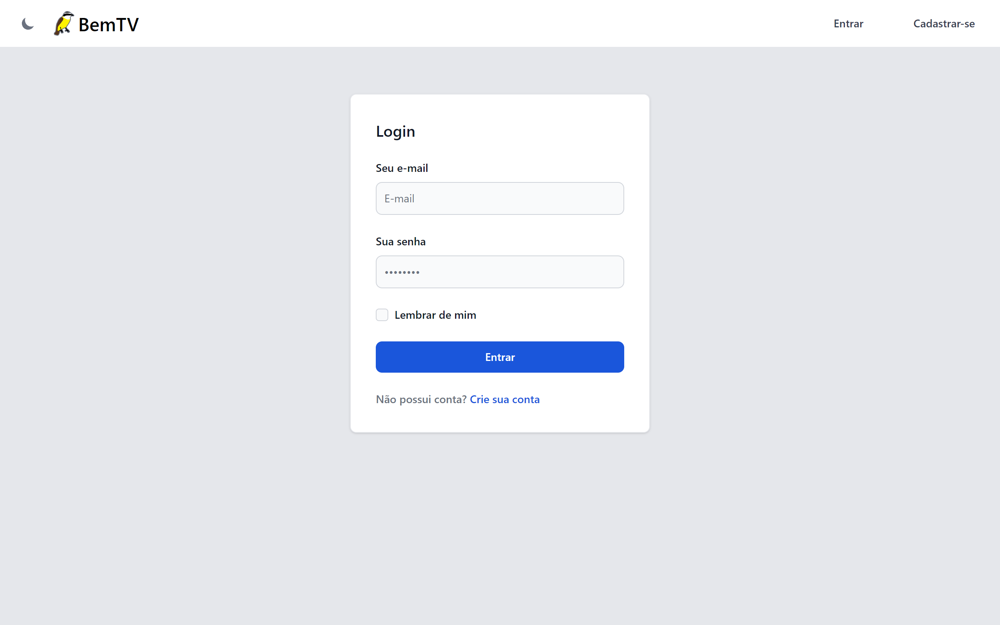
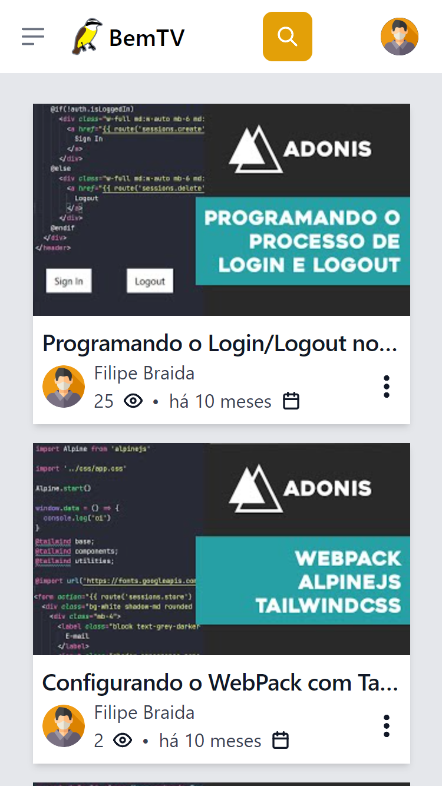

<h1> 
  
</h1>

  Este projeto foi desenvolvido no âmbito da disciplina de Programação para Web, com o objetivo de criar um site semelhante ao Youtube. Durante sua execução, foram aplicadas diversas tecnologias, tais como o Framework AdonisJS, Typescript, JavaScript, HTML, Tailwind CSS e SQL (PostgreSQL).

## Modo noturno

## Login/Cadastro

## Telas responsivas

